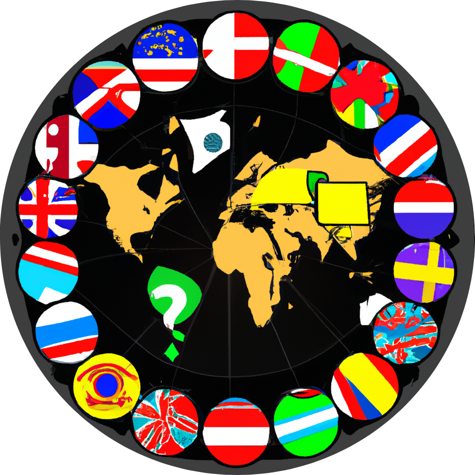

  

# FlagMania Client Application - SoPra FS23 - Group 27

## Introduction and Motivation
Welcome to FlagMania, the ultimate game that will put your knowledge of flags to the test! Are you ready to embark on an exciting journey around the world and showcase your flag recognition skills? Get ready to dive into two thrilling modes: Basic Game and Public Game.

In the Basic Game mode, we've carefully curated a series of challenging flag-based questions for you. Guess the flags of different countries based on our preselected options and see how many correct answers you can rack up! This mode is perfect for sharpening your flag identification abilities, learning about various countries, and competing against your friends to achieve the highest score.

But wait, if you're feeling extra adventurous and want to take your flag-guessing skills to the next level, then the Public Game mode is your ultimate destination! This mode provides you with a free submission form, where you can submit your guesses, allowing you to put your knowledge to the ultimate test. No limitations, no restrictions! Simply submit your best guess for each flag and let your intuition and expertise guide you to victory. Challenge yourself to recognize flags from every corner of the globe and prove that you are a true flag connoisseur.

Whether you're a beginner or a dedicated flag enthusiast, FlagMania offers an immersive and entertaining experience that will keep you engaged for hours. With its user-friendly interface and diverse range of flags from all over the world, this game is the perfect choice to expand your cultural knowledge and become a master at identifying flags.

So, what are you waiting for? Unleash your inner adventurer and test your flag knowledge. Get ready to explore the fascinating world of flags and become the ultimate FlagMania champion!

## Requirements

1. **Stable Internet Connection**: FlagMania is an online game, players will need a stable internet connection to play. We recommend a minimum internet speed of 5 Mbps for a smooth and seamless gameplay experience.
2. **Web Browser**: FlagMania is a web-based game, so players will need a web browser to play. We recommend using the latest version of Google Chrome or Mozilla Firefox for the best experience.
3. **Devices**: FlagMania is a web-based game, so players will need a device to play. We recommend using a laptop or desktop computer for the best experience. The use of smartphone and tablet devices is discouraged and may lead to a suboptimal experience.  If a user still chooses to play on a smartphone, playing in side view is recommended!

## Technologies
To establish a seamless connection between the frontend and backend, we have employed REST and Stomp-Websockets protocols. REST (Representational State Transfer) enables smooth communication and data transfer, allowing the frontend to interact with the backend effortlessly. Stomp-Websockets, a subprotocol of WebSocket, adds a layer of real-time communication, ensuring instant updates and an immersive gameplay experience.

Speaking of APIs, we have integrated two exceptional sources to bring the User of our applicaton accurate and up-to-date information. The first is the FLAGCDN API (https://flagcdn.com/), which supplies us with an extensive collection of country flags. With this API, we ensure that each flag displayed in the game is authentic and visually appealing (specifically, it was difficult finding an API that provides flags in high resolution), enhancing your learning experience.

Additionally, we have integrated the Country API from API Ninjas (https://api-ninjas.com/api/country) to provide the user of our application with fascinating facts surrounding each country. This API allows us to enrich the gameplay by helping the user guessing the flag with hints ranging from interesting trivia to helpful insights about the nations behind the flags.

### Frontend specific technologies
At the forefront, we have utilized [TypeScript](https://www.typescriptlang.org/) for the frontend development, ensuring a robust and scalable user interface. TypeScript enhances the development process by adding static typing and improved tooling to JavaScript, resulting in a more reliable and efficient Frontend experience.

[Mantine](https://mantine.dev/) is a React-based framework that provides a collection of customizable components and hooks. Mantine is used to build the frontend components, ensuring a consistent and visually appealing user interface. Mantine's components are highly customizable, allowing to tailor the user interface to our needs and preferences.

## High-level components
How do I make a Hyperlink:
In FlagMania, three classes play key roles in the functionality of both the backend and frontend components. These classes are the “Game” class in the backend, the “WebSocketService” class in the backend, and the “GameRound” class in the frontend. Let's take a closer look at each of them:
1.	[Game class](https://github.com/sopra-fs23-group-27/sopra-fs23-group-27-server/blob/main/src/main/java/ch/uzh/ifi/hase/soprafs23/entity/Game.java) (Backend): The Game class is a crucial component in the backend that manages the game logic and state. It encapsulates the core functionality of the game, including tracking the players, validating the players guesses guesses, managing scores, and determining the correct answers. This class is responsible for orchestrating the flow of the game by determining the procedures at the start of the game and at the end of the game, as well as the round start and round end, thereby keeping track of the game's progress.
2.	[WebSocketService class](https://github.com/sopra-fs23-group-27/sopra-fs23-group-27-server/blob/main/src/main/java/ch/uzh/ifi/hase/soprafs23/service/WebSocketService.java) (Backend): The WebSocketService class serves as a vital communication bridge between the frontend and backend components (in particular the Game class described above). It handles WebSocket connections, facilitates real-time messaging, and enables seamless interaction between players and the game server. This class includes methods to send messages to players and lobbies, manage player connections and disconnections, and handle reconnection procedures. It plays a crucial role in maintaining the game's real-time nature and enabling efficient communication between the different components. In particular, this class provides a crucial developer interface that makes websockets easy to use in other backend classes (such as the Game class). 
3.	[GameRound component](https://github.com/sopra-fs23-group-27/sopra-fs23-group-27-client/blob/main/src/views/GameRound.tsx) (Frontend): The GameRound class represents the view of a single round of the game on the frontend side. It manages the display of flag images, user interactions, displayal of hints and the submission of guesses (basic and advanced modes). This class handles the players guesses, updates the UI with other players wrong guesses, and progresses the game to the round summarizing scoreboard. It communicates with the backend, and in particular with the WebSocketService through Stomp-Websockets to fetch flags and hints and send guesses.
Overall, the Game, WebSocketService, and GameRound classes are the most important classes of FlagMania. They all work together to manage the game's logic, facilitate real-time communication, and provide an immersive gameplay experience. These classes form the core foundation of our game, and ensure its functionality.

## Launch & Deployment

In the project directory, you can run:

### `npm start`

Runs the app in the development mode.\
Open [http://localhost:3000](http://localhost:3000) to view it in the browser.

The page will reload if you make edits.\
You will also see any lint errors in the console.

### `npm test`

Launches the test runner in the interactive watch mode.\
See the section about [running tests](https://facebook.github.io/create-react-app/docs/running-tests) for more information.

### `npm run build`

Builds the app for production to the `build` folder.\
It correctly bundles React in production mode and optimizes the build for the best performance.

The build is minified and the filenames include the hashes.\
Your app is ready to be deployed!

See the section about [deployment](https://facebook.github.io/create-react-app/docs/deployment) for more information.

## Illustrations
In the following, you see the main landing page and entry point for a player to FlagMania. You can choose to login or register a user if you want to have your scores tracked. Alternatively, you can also play as a guest without registering.

If you click "Create New Game" you will be directed to the game creation page. Here you can choose a name for your lobby and select the game mode you want to play. You can either play the Basic Game, where you will be presented with a set of preselected flags and options to choose from, or the Public Game, where you can submit your own guesses for a set of flags. Once you have created your lobby, you will be redirected to the lobby page.

On the lobby page, you can see the lobby name, the game mode, and the players that have joined the lobby. You can also copy the lobby code and send it to your friends to invite them to join your lobby. Once you are ready to start the game, you can click "Start Game" and you will be redirected to the game page:

Now you are in the game! You can below see the layout of the basic mode. In basic mode you can select your guess by clicking on it. After all players have submitted their guess, the correct guess will light in green.

You can below see the layout of the advanced mode. In the advanced mode you can submit your guess by typing it into the submission field. On the right, you can see the wrong guesses other players have submitted:

Once you finished the round you get redirected to the scoreboard. It is displayed below. You can see each players current ranking with individual statistics for each player. Don't know what these statistics mean? Click the blue information icon and get your answers:

Congrats, you made it through the whole game! You are now displayed the final leaderboard below. Want to play another game? Then click "Play Again". Are you currently not logged in but still want to save your stats? Click "Register to Save Stats". Want to play a new game with a different lobby? Click "Go to Home":

If you navigate to your login screen, you see your overall statistics of all the games you have played:

## Roadmap
There are several features a new developer, who is desperate to contribute could add.
1.	The application does currently not come with mobile support. In order to grow the user base, this could be a vital new feature to FlagMania.
2.	A new developer might also consider adding support for multiple languages to make the game accessible to a global audience as well as allow users to switch between different language options and provide translations for flag names, instructions, and other textual elements.
3.	More exciting game are also considered a great expansion of FlagMania. Once could for example think of a timed mode where players must answer as many flags correctly as possible within a set time limit.
4.	Encouraging social interaction can enhance the game's community aspect and promote player engagement. One could think of integrating social media platforms or in-game chat functionality to facilitate communication and interaction among players. This could include features like sharing scores on social media platforms and inviting friends to play through short messages. 

## Authors and Acknowledgement
Developers:
-	[Dominic Tobler](https://github.com/DMC-CMD)
-	[Elias Schuhmacher](https://github.com/e-schuh)
-	[Richard Specker](https://github.com/rspecker)
-	[Noah Mamie](https://github.com/nmamie)
-	[Kilian Sennrich](https://github.com/ksennr)

We would like to thank the SoPra team and in particular [Sheena Lang](https://github.com/SheenaGit) for the valuable comments and contributions to the project.
Further, we extend our appreciation to the providers of the FLAGCDN API (https://flagcdn.com/) and the Country API from API Ninjas (https://api-ninjas.com/api/country). These APIs have played a crucial role in enriching our game by providing high-quality flags and fascinating country-related information. Their services have enhanced the authenticity and educational value of the game.

## License
This project is licensed under the MIT License.

Copyright (c) 2023

Permission is hereby granted, free of charge, to any person obtaining a copy of this software and associated documentation files (the "Software"), to deal in the Software without restriction, including without limitation the rights to use, copy, modify, merge, publish, distribute, sublicense, and/or sell copies of the Software, and to permit persons to whom the Software is furnished to do so, subject to the following conditions:
The above copyright notice and this permission notice shall be included in all copies or substantial portions of the Software.

THE SOFTWARE IS PROVIDED "AS IS", WITHOUT WARRANTY OF ANY KIND, EXPRESS OR IMPLIED, INCLUDING BUT NOT LIMITED TO THE WARRANTIES OF MERCHANTABILITY, FITNESS FOR A PARTICULAR PURPOSE AND NONINFRINGEMENT. IN NO EVENT SHALL THE AUTHORS OR COPYRIGHT HOLDERS BE LIABLE FOR ANY CLAIM, DAMAGES OR OTHER LIABILITY, WHETHER IN AN ACTION OF CONTRACT, TORT OR OTHERWISE, ARISING FROM, OUT OF OR IN CONNECTION WITH THE SOFTWARE OR THE USE OR OTHER DEALINGS IN THE SOFTWARE.
